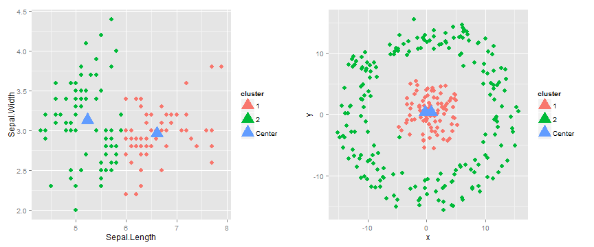

## What is k-means clustering ?

* K-means is a distance-based method for cluster analysis in data mining
* It enables partitioning a set of data points into groups which are as similar as possible
* Each group, called cluster, is represented by its center

# Algorithm  
  
Given K, the number of clusters, k-means clustering works as follows:

* Select K points as initial centroids
* __Repeat__
    * Form K clusters by assigning each point to its closest centroid
    * Re-compute the centroids of each cluster
* __Until__ convergence criterion is satisfied
* Different kinds of measures can be used (L1 norm, L2 norm, cosine similarity, ...)

--- .class #id 

## The Shiny App

* Illustrates K-mean clustering based on 2 datasets:
    * the R built in __iris__ dataset
    * a dataset __dat1__ involving embedded clusters
* Enables to change the following parameters:
    * dataset to be used
    * variables on which the clustering is to be performed (note: 2D clustering only)
    * number of clusters
    * type of kernel : linear or radial (RBF)
* When using a non-linear kernel, the datapoints are first projected into the kernel spaced before clustering is performed.  

The Application can be accessed directly [here](https://duf59.shinyapps.io/shiny-kmeans/)

--- .class #id 

## Example

* __Left panel__ : iris dataset, variables _sepal.length_ and _sepal.width_, 3 clusters and linear kernel
* __Right panel__ : dat1 dataset, variables _x_ and _y_, 2 clusters and RBF kernel. There we see that using a radial kernel enables distinguishing the two embedded clusters

--- .class #id 

## Source Code and further improvements

* The source code of the shiny App is available on my [GitHub Repo](https://github.com/duf59/shiny-kmeans)
* More informations on the K-means algorithm on [wikipedia](http://en.wikipedia.org/wiki/K-means_clustering). I also recommend the [Cluster Analysis In Data Mining](https://www.coursera.org/course/clusteranalysis) class on Coursera, which actually inspired me this app.
* Some possible improvements of this app include :
    * using interactive graphics (rchart, googleVis)
    * computing clustering validation measures such as purity, normalized mutual information, ... Note that such external measures require knowing the true classes of the data points, which is the case for the 2 implemented datasets but not in general. Instead one could also consider internal measures such as Beta CV.
    * Implementing other kernels (actually kkmeans() from the kernel packahe is used to compute kmeans with RBF kernel. Other kernels built in in kkmeans() could be easily added as an input)
    * Allow user to tune kernel parameters (actually the sigma parameter of RBF kernel is internally determined using an heuristic approach)

